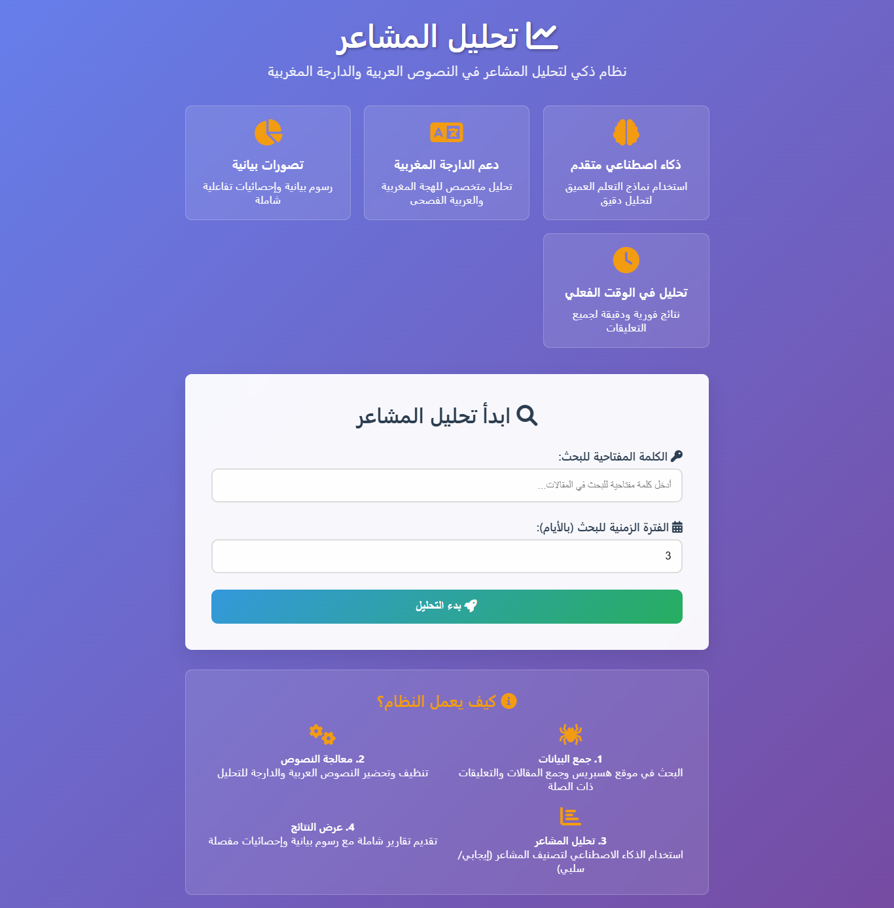
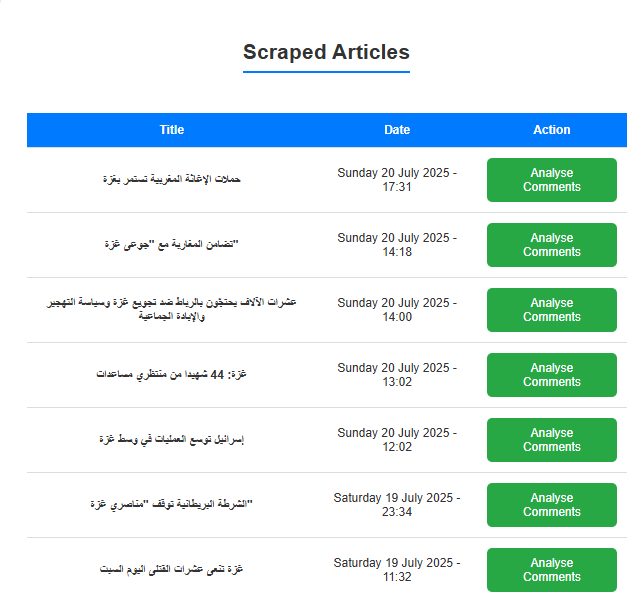

# 📊 Darija Sentiment Analysis Project

A comprehensive sentiment analysis application for Arabic/Darija text that combines web scraping, machine learning, and deep learning to analyze public sentiment from news articles and comments.

## 🎯 Project Overview

This project provides an end-to-end solution for sentiment analysis of Arabic/Darija text, featuring:
- **Web scraping** from Hespress news website
- **Traditional machine learning** models (SVM, KNN, Naive Bayes)
- **Deep learning** models (Bidirectional LSTM, CNN)
- **Interactive web interface** for real-time analysis
- **Comprehensive text preprocessing** for Arabic/Darija text
- **Visualization tools** including word clouds and sentiment charts

## 📁 Project Structure

```
darija-sentiment-analysis/
├── app.py                          # Main Flask application
├── package.py                      # Core scraping and preprocessing functions
├── requirements.txt                # Python dependencies
├── .env                           # Environment variables (API keys)
├── .gitignore                     # Git ignore rules
├── .gitattributes                 # Git LFS configuration
├── README.md                      # Project documentation
├── sentiments analysis/
│   └── ml.ipynb                   # Machine learning notebook
├── models/
│   └── model/
│       └── model.safetensors      # Pre-trained DarijaBERT model
├── templates/                     # HTML templates for web interface
│   ├── index.html                 # Homepage
│   ├── results.html               # Search results page
│   ├── comments.html              # Individual article comments
│   └── all_comments.html          # Aggregate sentiment analysis
├── static/                        # Static files (CSS, JS, images)
└── Stop_words.csv                 # Darija/Arabic stopwords dataset
```

## 📓 Notebooks Overview

### `sentiments analysis/ml.ipynb`
A comprehensive Jupyter notebook that implements and compares multiple sentiment analysis approaches:

#### 📚 **Traditional Machine Learning Models**
- **SVM (Support Vector Machine)** - Linear kernel with TF-IDF features
- **KNN (K-Nearest Neighbors)** - k=5 neighbors classification
- **Naive Bayes** - Multinomial variant for text classification

#### 🧠 **Deep Learning Models**
- **Bidirectional LSTM** - Sequential model with dropout and dense layers
- **CNN (Convolutional Neural Network)** - 1D convolution for text processing

#### 🔧 **Key Features**
- Comprehensive Arabic/Darija text preprocessing
- Emoji and special character handling
- Stopwords removal (Arabic + Darija)
- Text normalization and cleaning
- Model performance comparison and visualization
- Model serialization for production use

#### 💾 **Generated Assets**
- `svm_sentiment.pkl` - Trained SVM model
- `tfidf_vectorizer.pkl` - TF-IDF vectorizer
- `tokenizer.pkl` - Keras tokenizer for deep learning
- `best_model.h5` - Best performing deep learning model

## 🚀 How to Run the Project

### Prerequisites
- Python 3.8+
- Chrome browser (for web scraping)
- Git LFS (for model files)

### 1. Clone the Repository
```bash
git clone https://github.com/Youness331/Darija-sentiment-Analysis.git
cd Darija-sentiment-Analysis
```

### 2. Install Dependencies
```bash
pip install -r requirements.txt
```

### 3. Set up Environment Variables
Create a `.env` file in the project root:
```env
GEMINI_API_KEY=your_gemini_api_key_here
```

### 4. Download NLTK Data
```python
import nltk
nltk.download('punkt')
nltk.download('stopwords')
```

### 5. Run the Application
```bash
python app.py
```

The application will be available at `http://localhost:5000`

### 6. Using the Jupyter Notebook
```bash
jupyter notebook "sentiments analysis/ml.ipynb"
```

## 🖥️ User Interface Screenshots

### Homepage

*Main interface for entering search keywords and time range*

### Search Results

*Display of scraped articles matching the search criteria*


### Aggregate Sentiment Dashboard

[dashboard](screenshots/dash1.png)
[dashboard](screenshots/dash2.png)
[dashboard](screenshots/dash3.png)
## 🔧 Core Features

### Web Scraping
- **Dynamic content handling** with Selenium
- **Multi-article scraping** from Hespress.com
- **Comment extraction** with engagement metrics
- **Date-range filtering** for targeted analysis

### Text Preprocessing
- **Arabic text normalization** (diacritics removal, letter normalization)
- **Emoji handling** and repetitive character removal
- **Stopwords filtering** (Arabic + Darija)
- **HTML tag removal** and text cleaning

### Sentiment Analysis
- **DarijaBERT integration** for accurate Darija sentiment classification
- **Multiple model comparison** for robust predictions
- **Real-time analysis** through web interface
- **Batch processing** for multiple articles

### Visualization
- **Interactive pie charts** for sentiment distribution
- **Arabic word clouds** with proper text reshaping
- **Performance metrics** visualization
- **Model comparison** charts

## 📊 API Endpoints

- `GET /` - Homepage
- `POST /results` - Search and scrape articles
- `GET /analyze_comments/<article_link>` - Analyze individual article
- `POST /all_comments` - Aggregate sentiment analysis

## 🛠️ Technology Stack

- **Backend**: Flask, Python
- **Machine Learning**: scikit-learn, TensorFlow/Keras
- **NLP**: NLTK, Transformers (DarijaBERT)
- **Web Scraping**: Selenium, BeautifulSoup
- **Visualization**: Matplotlib, WordCloud
- **Frontend**: HTML, CSS, JavaScript
- **Arabic Text Processing**: arabic-reshaper, python-bidi

## 📈 Model Performance

The notebook includes comprehensive evaluation metrics:
- **Accuracy scores** for all models
- **Precision, Recall, F1-Score** comparisons
- **Training vs. Testing** performance analysis
- **Cross-validation results**

## 🔐 Security Features

- **Environment variables** for API keys
- **Git LFS** for large model files
- **Secure configuration** management
- **Production-ready** deployment setup

## 🤝 Contributing

1. Fork the repository
2. Create a feature branch (`git checkout -b feature/amazing-feature`)
3. Commit your changes (`git commit -m 'Add amazing feature'`)
4. Push to the branch (`git push origin feature/amazing-feature`)
5. Open a Pull Request

## 📄 License

This project is licensed under the MIT License - see the [LICENSE](LICENSE) file for details.

## 🙏 Acknowledgments

- **DarijaBERT** model from SI2M-Lab
- **Hespress.com** for providing Arabic news content
- **Google Gemini API** for report generation
- **Arabic NLP community** for stopwords and preprocessing techniques